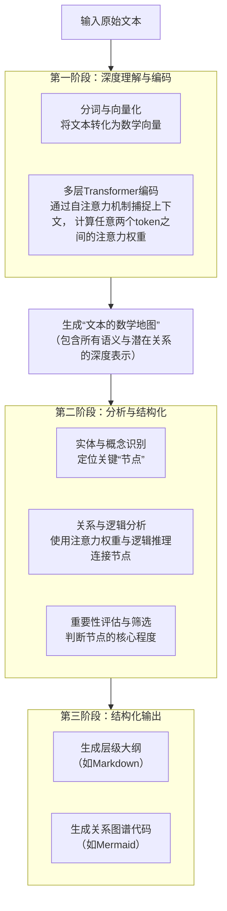

## app

- notebooklm
- mita ai


## 原理





多层Transformer


### 推理 Chain-of-Thought + Tree-of-Thought

思维链推理(chain-of-thought, CoT)是大语言模型处理复杂推理任务的重要能力。

CoT通过将问题分解为多个子问题，并逐步解决每个子问题，最终汇总得出完整答案 。

这种方式不仅提高了模型的准确性，还增强了推理过程的可解释性。


2024年以后最好的思维导图效果，全部来自隐式的ToT（思想树）
模型在生成前，会在内部先进行几步自问自答（你看不到，但CoT提示词能逼出来）：
```
这篇文章的终极目标/核心命题是什么？（找中心节点）
为了论证这个命题，作者用了哪几大论据/模块？（找一级分支）
每个模块内部的逻辑链条是什么？（找二级、三级）
有没有并列、因果、对立、递进、例证关系？
有没有隐藏的潜在假设、前置条件、风险点？
```
Claude 3.5 Sonnet/Opus 在这一步是目前最强的，它会自动构建一个隐式的思想树，然后再把树结构输出成思维导图。