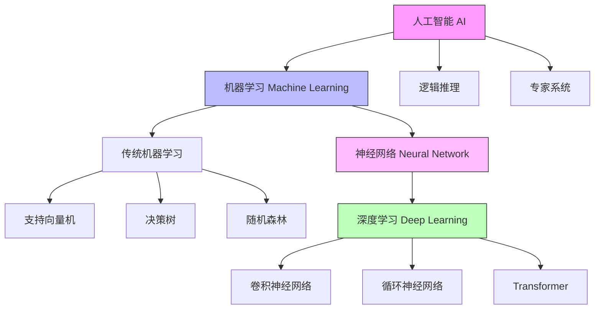
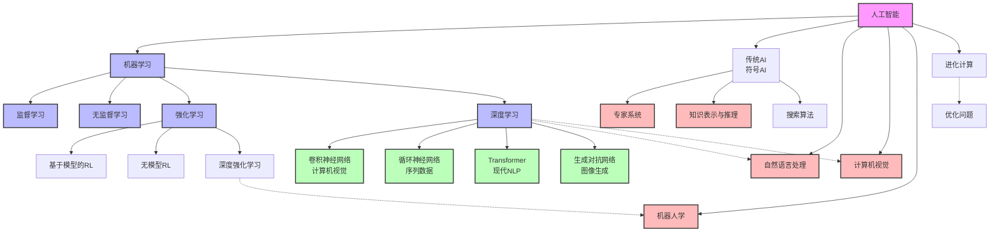

```mermaid
graph TD
    AI[人工智能 AI] --> ML[机器学习 Machine Learning]
    AI --> LOG[逻辑推理]
    AI --> EXP[专家系统]
    
    ML --> NN[神经网络 Neural Network]
    ML --> TRADITIONAL[传统机器学习]
    
    TRADITIONAL --> SVM[支持向量机]
    TRADITIONAL --> DT[决策树]
    TRADITIONAL --> RF[随机森林]
    
    NN --> DL[深度学习 Deep Learning]
    
    DL --> CNN[卷积神经网络]
    DL --> RNN[循环神经网络]
    DL --> TRANS[Transformer]
    
    style AI fill:#f9f,stroke:#333
    style ML fill:#bbf,stroke:#333
    style DL fill:#bfb,stroke:#333
    style NN fill:#fbf,stroke:#333
```

```mermaid
graph TD
    %% 主节点
    AI[人工智能] --> ML[机器学习]
    AI --> GOFAI[传统AI<br/>符号AI]
    
    %% 机器学习分支
    ML --> SL[监督学习]
    ML --> UL[无监督学习]
    ML --> RL[强化学习]
    ML --> DL[深度学习]
    
    %% 深度学习子分支
    DL --> CNN[卷积神经网络<br/>计算机视觉]
    DL --> RNN[循环神经网络<br/>序列数据]
    DL --> Transformer[Transformer<br/>现代NLP]
    DL --> GAN[生成对抗网络<br/>图像生成]
    
    %% 传统AI分支
    GOFAI --> ES[专家系统]
    GOFAI --> KRR[知识表示与推理]
    GOFAI --> Search[搜索算法]
    
    %% 应用领域
    AI --> NLP[自然语言处理]
    AI --> CV[计算机视觉]
    AI --> Robotics[机器人学]
    AI --> EC[进化计算]
    
    %% 强化学习子分支
    RL --> ModelBased[基于模型的RL]
    RL --> ModelFree[无模型RL]
    RL --> DRL[深度强化学习]
    
    %% 跨领域连接
    DL -.-> NLP
    DL -.-> CV
    DRL -.-> Robotics
    EC -.-> Optimization[优化问题]
    
    %% 样式定义
    classDef ai fill:#f9f,stroke:#333,stroke-width:2px
    classDef ml fill:#bbf,stroke:#333,stroke-width:2px
    classDef dl fill:#bfb,stroke:#333,stroke-width:2px
    classDef app fill:#fbb,stroke:#333,stroke-width:2px
    
    class AI ai
    class ML,SL,UL,RL,DL ml
    class CNN,RNN,Transformer,GAN dl
    class NLP,CV,Robotics,ES,KRR app
```