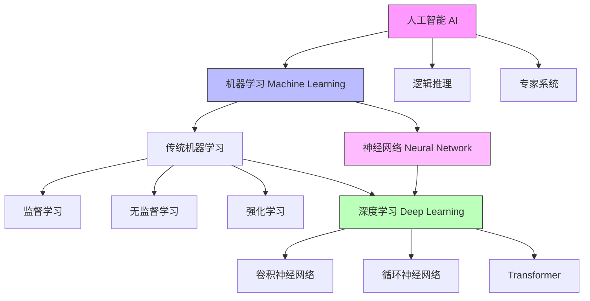

```mermaid
graph TD
    AI[人工智能 AI] --> ML[机器学习 Machine Learning]
    AI --> LOG[逻辑推理]
    AI --> EXP[专家系统]
    
    ML --> NN[神经网络 Neural Network]
    ML --> TRADITIONAL[传统机器学习]
    
    TRADITIONAL --> SL[监督学习]
    TRADITIONAL --> UL[无监督学习]
    TRADITIONAL --> RL[强化学习]
    TRADITIONAL --> DL[深度学习]
    
    NN --> DL[深度学习 Deep Learning]
    
    DL --> CNN[卷积神经网络]
    DL --> RNN[循环神经网络]
    DL --> TRANS[Transformer]
    
    style AI fill:#f9f,stroke:#333
    style ML fill:#bbf,stroke:#333
    style DL fill:#bfb,stroke:#333
    style NN fill:#fbf,stroke:#333
```

